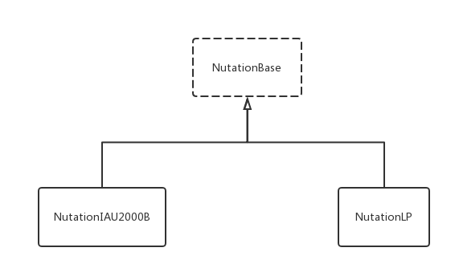

# Nutation 组件库

[](#) [](https://www.npmjs.com/package/@behaver/nutation) [](#)

## 简介

Nutation 组件库用于计算天文学中的地球章动运动，它包含组件 NutationIAU2000B 和 NutationLP，它们分别以 IAU2000B 模型和低精度快速模型作为计算使用模型。 Nutation 组件共用了同一组给定的 API，这组 API 由基类 NutationBase 给定，用户可基于 NutationBase 对模型组件进行扩展。

Nutation 系列组件的使用依赖于 [JDateRepository](https://github.com/behaver/jdate/blob/master/doc/JDateRepository.md)

## 用例

使用 Nutation 组件进行地球章动计算：

```js
const { NutationIAU2000B } = require('@behaver/nutation');
const { JDateRepository } = require('@behaver/jdate');

let jdr = new JDateRepository(new Date('1992/8/15 08:25:12'), 'date');
let nutation = new NutationIAU2000B(jdr);

// 黄经章动值
console.log(nutation.longitude);

// 交角章动值
console.log(nutation.obliquity);
```

## 类图



## API

`constructor(jdr)`
构造函数，参数 jdr 为章动计算的儒略时间变量，此处使用 JDateRepository 对象

`on(jdr)`
设定章动计算的儒略时间变量，此处使用 JDateRepository 对象

`get longitude()`
获取黄经章动角度，单位：角毫秒

`get obliquity()`
获取交角章动角度，单位：角毫秒

## 许可证书

The MIT license.