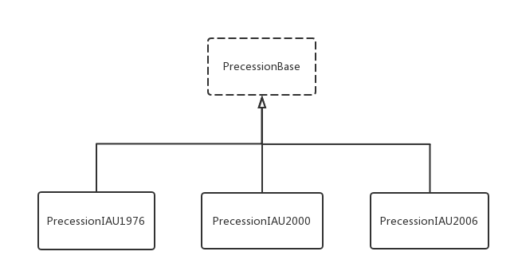

# Precession 组件库

[](#) [](https://www.npmjs.com/package/@behaver/precession) [](#)

## 简介

Precession 组件库用于计算天文学中的地球岁差运动，它包含组件：PrecessionIAU1976、PrecessionIAU2000 和 PrecessionIAU2006 ，它们分别是以 IAU1976、IAU2000 和 IAU2006 作为岁差计算模型。Precession 组件共用了同一组给定的 API，这组 API 由基类 PrecessionBase 给定，用户可基于 PrecessionBase 对模型组件进行扩展。

Precession 系列组件的使用依赖于 [JDateRepository](https://github.com/behaver/jdate/blob/master/doc/JDateRepository.md)

## 用例

通过npm安装，在项目目录下执行：

`npm i @behaver/precession`

---

使用 PrecessionIAU2006 组件计算岁差项：

```js
const { PrecessionIAU2006 } = require('@behaver/precession');
const { JDateRepository } = require('@behaver/jdate');

let jdr = new JDateRepository(new Date('1992/8/15 08:25:12'), 'date');
let precession = new PrecessionIAU2006(jdr);

// 岁差计算项 ε 的数值
console.log(precession.epsilon);

// 岁差计算项 ω 的数值
console.log(precession.omega);
```

## 类图



## API

`constructor(jdr)`
构造函数，参数 jdr 为岁差计算的儒略时间变量，此处使用 JDateRepository 对象。

`on(jdr)`
设定岁差计算的儒略时间变量，此处使用 JDateRepository 对象。

`get(key)`
获取 岁差计算项 数值，单位：角秒。

`get P()`
获取 岁差计算项 Ρ 的数值，单位：角秒。

`get Q()`
获取 岁差计算项 Q 的数值，单位：角秒。

`get eta()`
获取 岁差计算项 η 的数值，单位：角秒。
岁差项 η(eta) 是 J2000 黄道面与终历元黄道面的夹角

`get pi()`
获取 岁差计算项 Π 的数值，单位：角秒。

`get p()`
获取 岁差计算项 p 的数值，单位：角秒。

`get epsilon()`
获取 岁差计算项 ε 的数值，单位：角秒。
岁差项 ε(epsilon) 为黄赤交角。

`get chi()`
获取 岁差计算项 χ 的数值，单位：角秒。
岁差项 χ(chi) 为黄道岁差（行星岁差），是 J2000 春分点与终历元春分点在赤道上东移的夹角。

`get omega()`
获取 岁差计算项 ω 的数值，单位：角秒。
岁差项 ω(omega) 为瞬时赤道与历元黄道间的夹角。

`get psi()`
获取 岁差计算项 ψ 的数值，单位：角秒。
岁差项 ψ(psi) 为赤道岁差（日月岁差），是 J2000 春分点与终历元春分点在黄道上西移的夹角。

`get theta()`
获取 岁差计算项 θ 的数值，单位：角秒。

`get zeta()`
获取 岁差计算项 ζ 的数值，单位：角秒。

`get z()`
获取 岁差计算项 z 的数值，单位：角秒。

## 许可证书

The MIT license.